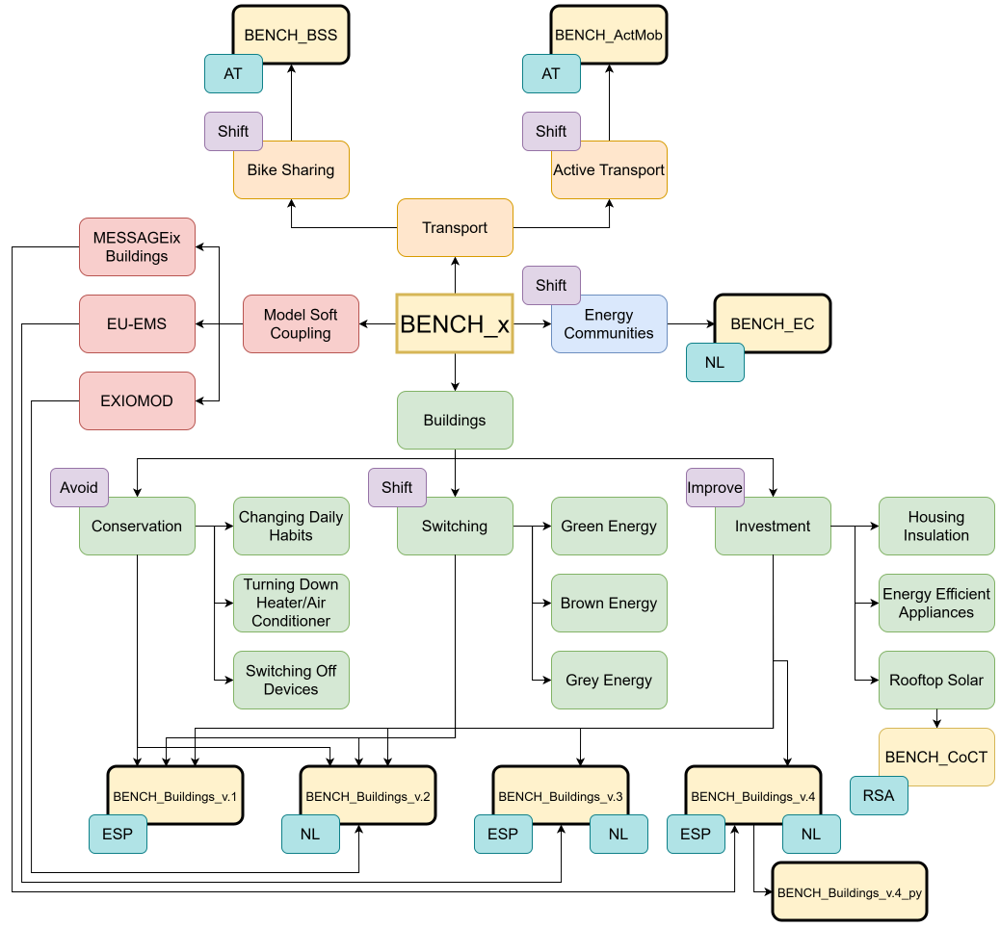

# BENCH_x_ABM Model Family Archive

[](https://doi.org/10.5281/zenodo.20798923)

Welcome to the central repository for the **BENCH_x_ABM (The Behavioral change in ENergy Consumption of Households Agent-Bade Model)** model family. This archive preserves, documents, and provides download access to various iterations of the BENCH framework. 

## BENCH_x_ABM model family:




---

## Active Code Repository Summary 

| Model Directory | Language | Associated publication |
| :--- | :--- | :--- |
| **BENCH_Buildings_v.1** | NetLogo | [Transition to low-carbon economy: Assessing cumulative impacts of individual behavioral changes (2018)](https://doi.org/10.1016/j.enpol.2018.03.045) |
| [**BENCH_Buildings_v.2**](./models/BENCH_v.2) | NetLogo | [Assessing the macroeconomic impacts of individual behavioral changes on carbon emissions (2020)](https://link.springer.com/article/10.1007/s10584-019-02566-8) |
| [**BENCH_Buildings_v.3**](./models/BENCH_v.3) | NetLogo | [Economy-wide impacts of behavioral climate change mitigation: Linking agent-based and computable general equilibrium models (2020)](https://doi.org/10.1016/j.envsoft.2020.104839) |
| [**BENCH_BSS**](./models/BENCH_BSS) | Python (Mesa) | Modelling bike-sharing service adoption in urban areas: a case study of Vienna (2024) |
| [**BENCH_Buildings_v.4**](./models/BENCH_v04) | NetLogo | [Energizing building renovation: Unraveling the dynamic interplay of building stock evolution, individual behaviour, and social norms (2024)](https://www.sciencedirect.com/science/article/pii/S2214629624000367) |
| [**BENCH_ActMob**](./models/BENCH_ActMob) | Python (Mesa) | [Urban Strategies for Active Mobility in Vienna (2026)](https://papers.ssrn.com/sol3/papers.cfm?abstract_id=6604470) |
| [**BENCH_Buildings_v.4_py**](https://github.com/danielTorren/bench_py_v4) | Python | — |
| [**BENCH_EC**](https://github.com/NEON-Research/Energy-community-potential-model) | AnyLogic | [Quantifying the potential of energy communities in renewable electricity generation in The Netherlands (2026)](https://doi.org/10.1016/j.erss.2025.104523) |


---

## Isolated Model Downloads (How to access the code)

To prevent cluttering your local environment with unnecessary dependencies or massive file trees, **do not download the code by cloning the master branch**. 

Instead, this project utilizes isolated **GitHub Releases**:
1. Look at the right-hand panel of this page and click on **Releases**.
2. Select the specific model version you are interested in (e.g., `BENCH_BSS`).
3. Under the **Assets** section of that release, download the standalone `.zip` archive containing only that model's code, scripts, and inputs.

---

## Repository Architecture

```text
BENCH-x-ABM-model-archive/
├── docs/                              # GitHub Pages website
│   ├── index.html                     # Website landing page
│   ├── BENCH_Family_Models_diagram.svg   # Model family diagram
│   └── BENCH_Family_Models_diagram.drawio  # Editable diagram source
├── models/                            # Contained model directories
│   ├── BENCH_Buildings_v.2/                     # NetLogo
│   ├── BENCH_Buildings_v.3/                     # NetLogo — CGE-ABM integration
│   ├── BENCH_BSS/                     # Python (Mesa) — bike-sharing
│   ├── BENCH_Buildings_v.4/                     # NetLogo — building renovation
│   ├── BENCH_ActMob/                  # Python (Mesa) — active mobility
├── .gitignore
├── ADDING_A_MODEL.md                  # Guide for adding new models
└── README.md
```
---

## Citation

If you use this archive or any of the models included, please cite both the foundational paper and the specific software repository release:

```bibtex

@article{niamir2018transition,
  title={Transition to low-carbon economy: Assessing cumulative impacts of individual behavioral changes},
  author={Niamir, Leila and Filatova, Tatiana and Voinov, Alexey and Bressers, Hans},
  journal={Energy policy},
  volume={118},
  pages={325--345},
  year={2018},
  publisher={Elsevier},
  doi     = {10.1016/j.enpol.2018.03.045},
  url     = {https://doi.org/10.1016/j.enpol.2018.03.045}
}

@software{bench_models_archive_2026,
  title  = {BENCH: An Open-Source Model Archive},
  author = {Niamir, Leila},
  year   = {2026},
  version = {1.0.1},
  doi    = {10.5281/zenodo.20798923},
  url    = {https://github.com/BENCH-Models/bench-model-archive}
}

```