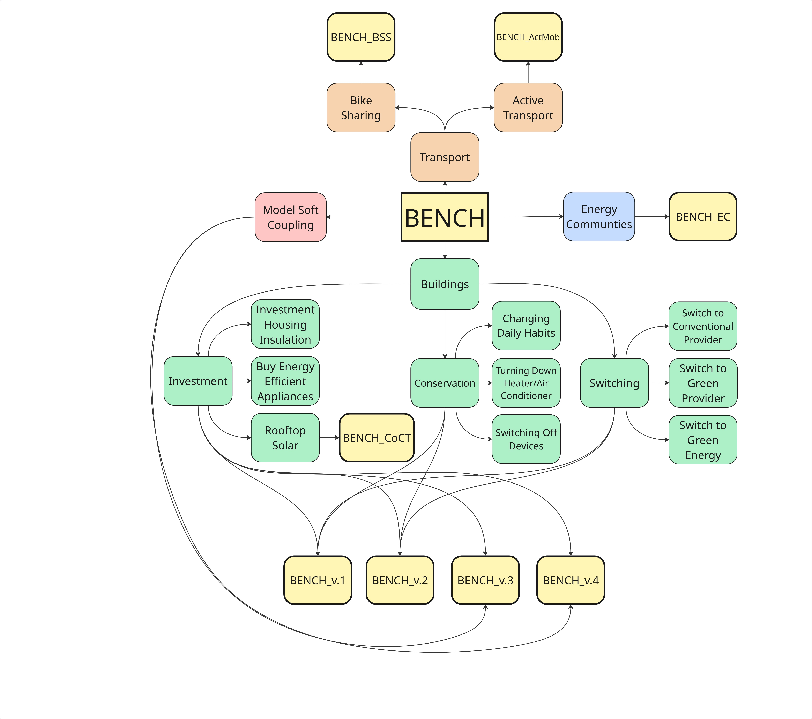

# BENCH Model Family Archive

Welcome to the central repository for the **BENCH (The Behavioral change in ENergy Consumption of Households)** model family. This archive preserves, documents, and provides download access to various iterations of the BENCH framework. 

## BENCH model family:




---

## Active Code Repository Summary 

| Model Directory | Language | Associated publication |
| :--- | :--- | :--- |
| [**BENCH_v.2**](./models/BENCH_v.2) | NetLogo | [Assessing the macroeconomic impacts of individual behavioral changes on carbon emissions (2020)](https://link.springer.com/article/10.1007/s10584-019-02566-8) |
| [**BENCH_BSS**](./models/BENCH_BSS) | Python (Mesa) | Modelling bike-sharing service adoption in urban areas: a case study of Vienna (2024) |
| [**BENCH_v.4**](./models/BENCH_v04) | NetLogo | [Energizing building renovation: Unraveling the dynamic interplay of building stock evolution, individual behaviour, and social norms (2024)](https://www.sciencedirect.com/science/article/pii/S2214629624000367) |
| [**BENCH_ActMob**](./models/BENCH_ActMob) | Python (Mesa) | [Urban Strategies for Active Mobility in Vienna (2026)](https://papers.ssrn.com/sol3/papers.cfm?abstract_id=6604470) |


---

## Isolated Model Downloads (How to access the code)

To prevent cluttering your local environment with unnecessary dependencies or massive file trees, **do not download the code by cloning the master branch**. 

Instead, this project utilizes isolated **GitHub Releases**:
1. Look at the right-hand panel of this page and click on **Releases**.
2. Select the specific model version you are interested in (e.g., `BENCH_BSS`).
3. Under the **Assets** section of that release, download the standalone `.zip` archive containing only that model's code, scripts, and inputs.

---

## Repository Architecture

```text
bench-model-archive/
├── docs/                   # GitHub Pages web deployment files
│   ├── index.md            # Website landing page
│   └── image_e61c41.png    # Model interconnections diagram
└── models/                 # Contained model directories
    ├── BENCH_v.2/          # NetLogo
    ├── BENCH_BSS/          # Python Mesa bike-sharing model
    ├── BENCH_v.4/          # NetLogo MESSAGEix integration
    ├── BENCH_ActMob/       # Python Mesa active mobility model